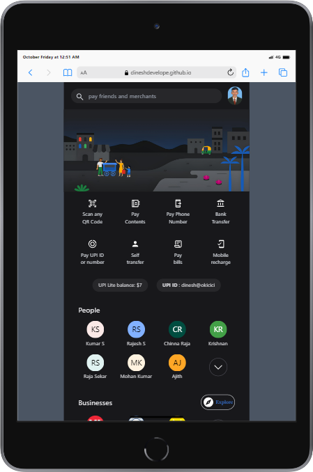

# Project Title

# Gpay-Clone Using HTML,Tailwind CSS

## Table of Contents

- [Gpay-clone](#Gpay-clone)
- [Description](#description)
- [Demo](#demo)
- [Internship](#internship)
- [Technologies Used](#technologies-used)
- [Installation](#installation)

## Description

Google Pay UI clone build with Tailwind css and html

## Demo

[Live Preview ](https://dineshdevelope.github.io/Google-pay_UI/)



## Internship

This internship is provided by [CyberDude Networks Pvt. Ltd.](https://youtube.com/cyberdudenetworks) as part of the 6-Month Free Internship program, a skill development initiative organized to enhance participants' skills. Mentoring was provided by [Mr. Anbuselvan Rocky](https://instagram.com/anbuselvanrocky). For more information, [you can contact CyberDude Networks here](https://cyberdudenetworks.com).

## Technologies Used

List the technologies, programming languages, and libraries/frameworks used in your project.

- HTML
- Tailwind CSS

## Installation

Clone the Repository:

```
git clone https://github.com/dineshdevelope/Google-pay_UI.git
```

Navigate to the project

```
cd Instagram-UI-Tailwind
```

Install the Dependencies

```
npm install
```

Run the Project

```
npm run dev
```
